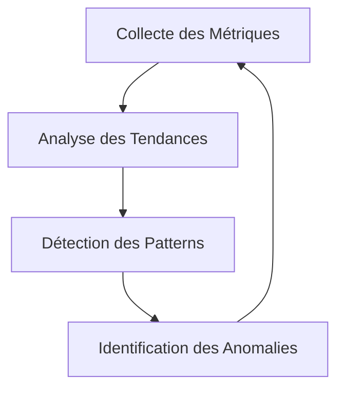
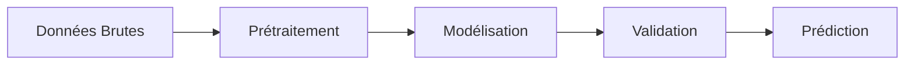

# 🎯 Méthodologie de Divination Système

## 📋 Vue d'Ensemble

Cette méthodologie définit l'approche systématique pour la prédiction et l'analyse des comportements système.

## 🔄 Cycle de Divination

### 1. Phase d'Observation

### 2. Phase d'Analyse

## 📊 Métriques Clés

### 1. Performance Système
- Utilisation CPU
- Consommation Mémoire
- Latence Réseau
- IOPS Disque

### 2. Métriques Applicatives
- Temps de Réponse
- Taux d'Erreur
- Throughput
- Concurrence

## 🛠 Outils et Techniques

### 1. Collecte de Données
- Agents de Monitoring
- Logs Système
- Métriques Applicatives
- Traces Réseau

### 2. Analyse
- Outils Statistiques
- Machine Learning
- Visualisation
- Corrélation

## 📈 Processus d'Analyse

1. **Collecte**
   - Configuration des sources
   - Validation des données
   - Stockage sécurisé
   - Nettoyage

2. **Traitement**
   - Agrégation
   - Normalisation
   - Enrichissement
   - Corrélation

3. **Analyse**
   - Modélisation
   - Prédiction
   - Validation
   - Documentation

## 🎯 Objectifs

1. **Court Terme**
   - Détection d'anomalies
   - Prévention des incidents
   - Optimisation continue

2. **Long Terme**
   - Planification capacitaire
   - Évolution architecturale
   - Amélioration continue

## 📝 Documentation

### 1. Rapports
- Rapports quotidiens
- Analyses hebdomadaires
- Revues mensuelles
- Prédictions trimestrielles

### 2. Alertes
- Seuils critiques
- Tendances anormales
- Prédictions négatives
- Recommandations

## 🔍 Validation

1. **Métriques de Validation**
   - Précision des prédictions
   - Taux de faux positifs
   - Temps de détection
   - Efficacité des actions

2. **Processus de Révision**
   - Revue des prédictions
   - Ajustement des modèles
   - Amélioration continue
   - Documentation des leçons

## 📚 Références

1. **Standards**
   - ISO/IEC 27001
   - ITIL v4
   - SRE Principles
   - DevOps Practices

2. **Best Practices**
   - Google SRE
   - AWS Well-Architected
   - Microsoft Azure Architecture
   - Netflix Technology Blog 