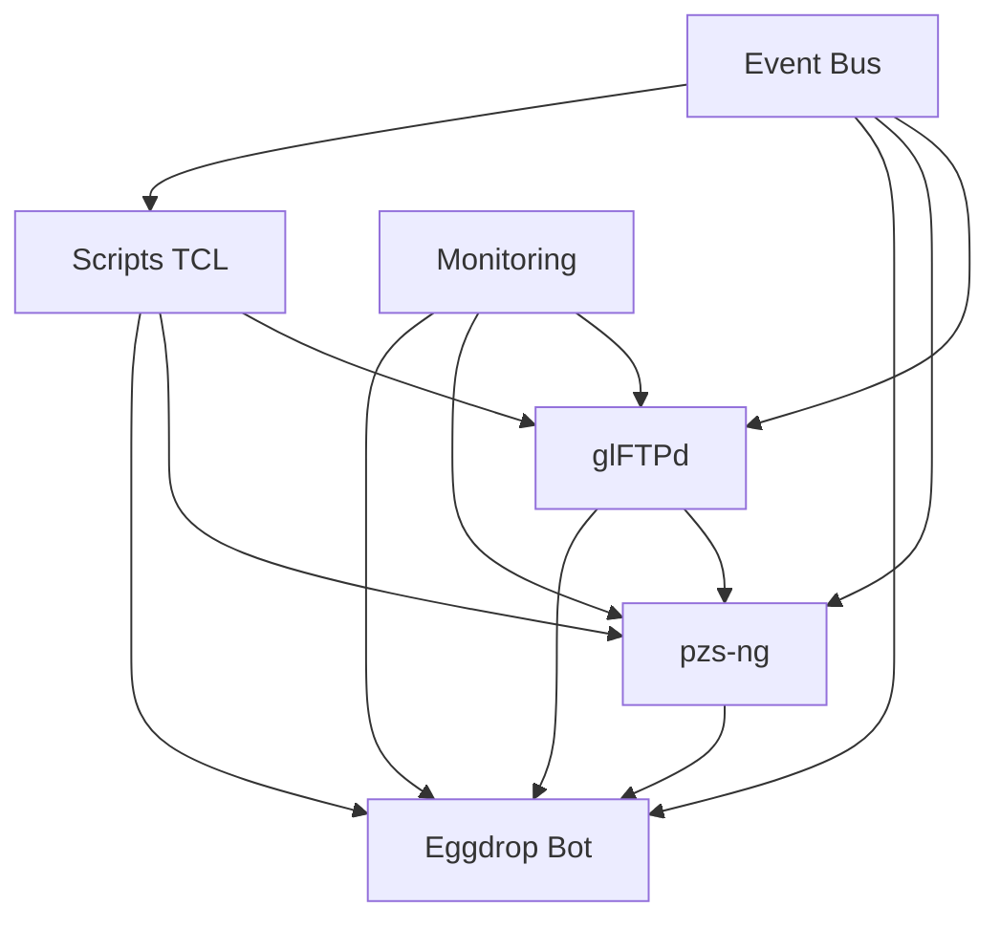

# 🏗 Architecture Globale du Système

## 📋 Vue d'Ensemble



## 🎯 Composants Principaux

### 1. Core Services
```yaml
glFTPd:
  role: Service FTP principal
  composants:
    - Système de fichiers
    - Gestion utilisateurs
    - Système de permissions
    - Hooks système
  dependencies:
    - OpenSSL >= 1.1.1
    - TCL >= 8.6
    - xinetd

pzs-ng:
  role: Zipscript & Race Management
  composants:
    - Traitement fichiers
    - Race control
    - Stats système
    - Hooks glFTPd
  dependencies:
    - glFTPd
    - TCL >= 8.6
    - zlib

Eggdrop:
  role: Bot & Automation
  composants:
    - Annonces
    - Stats
    - Commandes
    - Monitoring
  dependencies:
    - TCL >= 8.6
    - OpenSSL
    - pzs-ng scripts
```

### 2. Intégration
```yaml
Scripts TCL:
  - Automation système
  - Hooks personnalisés
  - Intégration services
  - Gestion événements

Monitoring:
  - Performance système
  - Statistiques
  - Alertes
  - Reporting
```

## 🛠 Architecture Technique

### 1. Infrastructure
```yaml
Système:
  OS: Linux
  File System: XFS/EXT4
  Network: Gigabit+
  Storage: RAID Configuration

Services:
  - glFTPd (Port 21)
  - Eggdrop (IRC)
  - pzs-ng (Hooks)
  - Scripts TCL
```

### 2. Communication
```yaml
Protocols:
  - FTP (glFTPd)
  - IRC (Eggdrop)
  - IPC (Inter-Process)
  - Custom Hooks

Integration:
  - Event Driven
  - Message Queue
  - Shared Memory
  - File Based
```

## 📊 Performance & Scalabilité

### 1. Métriques Clés
```yaml
Performance:
  - Vitesse transfert
  - Latence système
  - Utilisation ressources
  - Temps traitement

Capacité:
  - Utilisateurs simultanés
  - Bande passante
  - Storage
  - CPU/RAM
```

### 2. Optimisation
```yaml
Stratégies:
  - I/O Optimization
  - Network Tuning
  - Memory Management
  - Process Priority

Monitoring:
  - Real-time stats
  - Performance alerts
  - Resource tracking
  - Capacity planning
```

## 🔐 Sécurité

### 1. Architecture Sécurité
```yaml
Access Control:
  - Authentication
  - Authorization
  - Accounting
  - Audit

Network Security:
  - Firewall
  - SSL/TLS
  - VPN
  - IDS/IPS
```

### 2. Monitoring Sécurité
```yaml
Detection:
  - Intrusion Detection
  - Anomaly Detection
  - Log Analysis
  - Security Alerts

Response:
  - Incident Response
  - Security Updates
  - Patch Management
  - Security Audits
```

## 📈 Évolution & Maintenance

### 1. Roadmap
```yaml
Phase 1:
  - Installation base
  - Configuration core
  - Tests initiaux
  - Monitoring base

Phase 2:
  - Optimisation
  - Automatisation
  - Scripts avancés
  - Monitoring avancé

Phase 3:
  - Haute disponibilité
  - Scaling
  - Analytics
  - Reporting avancé
```

### 2. Maintenance
```yaml
Routine:
  - Daily checks
  - Backups
  - Updates
  - Performance tuning

Monitoring:
  - System health
  - Performance metrics
  - Security events
  - Capacity trends
```

## 🔄 Processus DevOps

### 1. Déploiement
```yaml
Process:
  - Version Control
  - Testing
  - Staging
  - Production

Automation:
  - Scripts deployment
  - Config management
  - Service restart
  - Rollback
```

### 2. Monitoring
```yaml
Tools:
  - System monitors
  - Log aggregators
  - Performance tools
  - Alert systems

Integration:
  - Centralized logging
  - Metrics collection
  - Alert management
  - Reporting
``` 