# 📊 Système de Monitoring Tur-Request

## 🔍 1. Vue d'Ensemble

### 1.1 Architecture Monitoring

```mermaid
graph TD
    A[Collecteurs] --> B[Agrégation]
    B --> C[Stockage]
    C --> D[Analyse]
    D --> E[Alerting]
    D --> F[Reporting]
    D --> G[Dashboard]
```


### 1.2 Composants
```yaml
Core Components:
  Collectors:
    - Request Events
    - System Metrics
    - User Activities
    - Performance Data
  
  Storage:
    - Time Series DB
    - Event Logs
    - Stats Cache
    - Historical Data

  Processing:
    - Real-time Analysis
    - Pattern Detection
    - Trend Analysis
    - Predictive Alerts
```

## 📈 2. Métriques

### 2.1 Performance Metrics
```yaml
System:
  Request Processing:
    - Latency: ms
    - Throughput: req/s
    - Error Rate: %
    - Queue Length
  
  Resource Usage:
    - CPU: %
    - Memory: MB
    - Disk IO: ops/s
    - Network: MB/s

  Cache:
    - Hit Rate: %
    - Miss Rate: %
    - Eviction Rate
    - Size: MB
```

### 2.2 Business Metrics
```yaml
Request Stats:
  Volume:
    - Total Requests
    - Active Requests
    - Completed Requests
    - Failed Requests
  
  Performance:
    - Fill Rate
    - Response Time
    - Success Rate
    - User Satisfaction

  Users:
    - Active Users
    - Request/User
    - Fill/User
    - Points/User
```

## 🚨 3. Alerting

### 3.1 Alert Rules
```yaml
Critical:
  System:
    - CPU > 90% for 5m
    - Memory > 85% for 5m
    - Disk Space < 10%
    - Error Rate > 5%
  
  Application:
    - Request Queue > 100
    - Processing Time > 10s
    - Failed Requests > 10/min
    - Cache Miss > 50%

Warning:
  System:
    - CPU > 75% for 10m
    - Memory > 75% for 10m
    - Disk Space < 20%
    - Error Rate > 2%
  
  Application:
    - Request Queue > 50
    - Processing Time > 5s
    - Failed Requests > 5/min
    - Cache Miss > 30%
```

### 3.2 Notification Channels
```yaml
Channels:
  IRC:
    - #request-alerts: Critical
    - #request-monitor: Warning
    - #request-stats: Info
  
  Admin:
    - Direct Message
    - Email
    - Push Notification
    - Web Hook
```

## 📊 4. Dashboards

### 4.1 Real-time Overview
```yaml
Panels:
  System Health:
    - Current Status
    - Resource Usage
    - Error Rates
    - Performance Trends
  
  Request Status:
    - Active Requests
    - Processing Queue
    - Success Rate
    - Response Time
  
  User Activity:
    - Connected Users
    - Request Volume
    - Fill Activity
    - Points Distribution
```

### 4.2 Historical Analysis
```yaml
Reports:
  Daily:
    - Request Summary
    - Performance Stats
    - User Activity
    - System Health
  
  Weekly:
    - Trend Analysis
    - User Rankings
    - System Performance
    - Resource Usage
  
  Monthly:
    - Capacity Planning
    - User Behavior
    - Pattern Analysis
    - Optimization Suggestions
```

## 🔧 5. Maintenance

### 5.1 Data Management
```yaml
Retention:
  Metrics:
    - Real-time: 24h
    - Hourly: 30d
    - Daily: 1y
    - Monthly: 5y
  
  Logs:
    - Debug: 24h
    - Info: 7d
    - Warning: 30d
    - Error: 90d
```

### 5.2 System Health
```yaml
Checks:
  Automated:
    - Service Status
    - Resource Usage
    - Data Integrity
    - Performance Tests
  
  Manual:
    - Config Review
    - Log Analysis
    - Security Audit
    - Backup Verification
```

## 🔐 6. Sécurité

### 6.1 Access Control
```yaml
Roles:
  Admin:
    - Full Access
    - Configuration
    - Alert Management
    - System Control
  
  Operator:
    - View Dashboards
    - Acknowledge Alerts
    - Run Reports
    - Basic Management
  
  User:
    - View Own Stats
    - Basic Metrics
    - Public Dashboards
```

### 6.2 Audit Trail
```yaml
Logging:
  Actions:
    - Configuration Changes
    - Alert Management
    - User Access
    - System Events
  
  Format:
    - Timestamp
    - User
    - Action
    - Details
    - Source IP
``` 