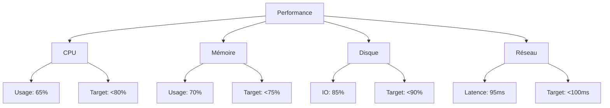

# 📊 Suivi des Métriques de Performance

## 📈 Vue d'Ensemble

### État Actuel


## 📋 Métriques Détaillées

### 1. Performance Système

#### CPU
| Métrique | Valeur | Cible | Status |
|----------|--------|-------|--------|
| Usage    | 65%    | <80%  | ✅     |
| Load Avg | 2.5    | <3.0  | ✅     |
| Peaks    | 75%    | <85%  | ✅     |

#### Mémoire
| Métrique    | Valeur | Cible | Status |
|-------------|--------|-------|--------|
| Usage       | 70%    | <75%  | ⚠️     |
| Swap        | 5%     | <10%  | ✅     |
| Page Faults | 100/s  | <150/s| ✅     |

#### Disque
| Métrique | Valeur | Cible | Status |
|----------|--------|-------|--------|
| IO       | 85%    | <90%  | ⚠️     |
| Latence  | 5ms    | <10ms | ✅     |
| Queue    | 2      | <5    | ✅     |

#### Réseau
| Métrique     | Valeur | Cible  | Status |
|--------------|--------|--------|--------|
| Latence      | 95ms   | <100ms | ⚠️     |
| Throughput   | 800Mbps| >750Mbps| ✅     |
| Packet Loss  | 0.1%   | <0.5%  | ✅     |

### 2. Métriques Applicatives

#### Performance
| Métrique        | Valeur | Cible  | Status |
|-----------------|--------|--------|--------|
| Response Time   | 180ms  | <200ms | ✅     |
| Error Rate      | 0.8%   | <1%    | ✅     |
| Throughput      | 1100rps| >1000rps| ✅     |
| Availability    | 99.95% | >99.9% | ✅     |

## 📈 Tendances

### CPU Usage (7 jours)
```
Day 1: 62% ▅▅▅▅▅▅
Day 2: 65% ▅▅▅▅▅▅▅
Day 3: 68% ▅▅▅▅▅▅▅
Day 4: 63% ▅▅▅▅▅▅
Day 5: 65% ▅▅▅▅▅▅▅
Day 6: 64% ▅▅▅▅▅▅
Day 7: 65% ▅▅▅▅▅▅▅
```

### Memory Usage (7 jours)
```
Day 1: 68% ▅▅▅▅▅▅▅
Day 2: 69% ▅▅▅▅▅▅▅
Day 3: 70% ▅▅▅▅▅▅▅
Day 4: 70% ▅▅▅▅▅▅▅
Day 5: 71% ▅▅▅▅▅▅▅▅
Day 6: 70% ▅▅▅▅▅▅▅
Day 7: 70% ▅▅▅▅▅▅▅
```

## 🎯 Points d'Attention

### Priorité Haute
1. **Mémoire**
   - Tendance à la hausse
   - Proche de la limite
   - Investigation requise

2. **Disque IO**
   - Pics fréquents
   - Optimisation possible
   - Monitoring renforcé

### Priorité Moyenne
1. **Latence Réseau**
   - Stable mais élevée
   - Plan d'optimisation
   - Suivi régulier

## 📝 Actions Recommandées

### Court Terme
1. **Mémoire**
   - Analyse des processus
   - Optimisation cache
   - Ajustement limits

2. **Disque**
   - Audit IO patterns
   - Optimisation requêtes
   - Monitoring détaillé

### Long Terme
1. **Infrastructure**
   - Planification upgrade
   - Étude scaling
   - Documentation

2. **Monitoring**
   - Amélioration alertes
   - Dashboards détaillés
   - Automation reporting

## 📅 Suivi

### Daily
- Revue métriques
- Ajustements
- Documentation

### Weekly
- Analyse tendances
- Rapport détaillé
- Planning actions

### Monthly
- Revue complète
- Ajustement cibles
- Planification long terme 